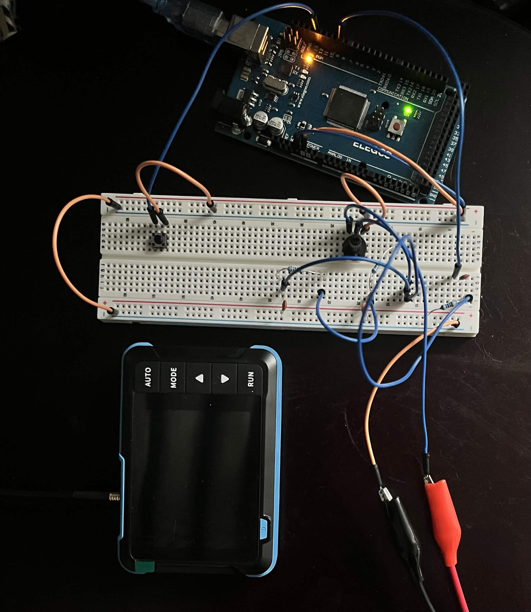
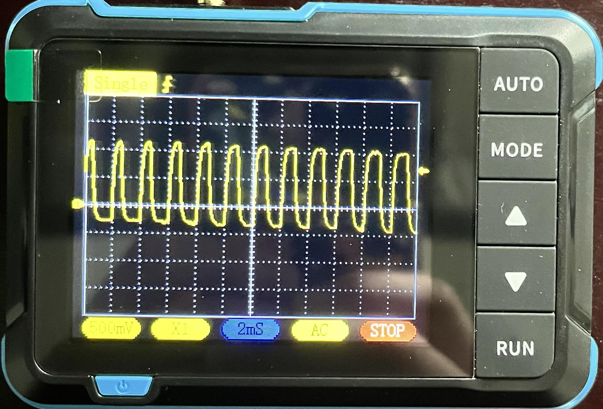
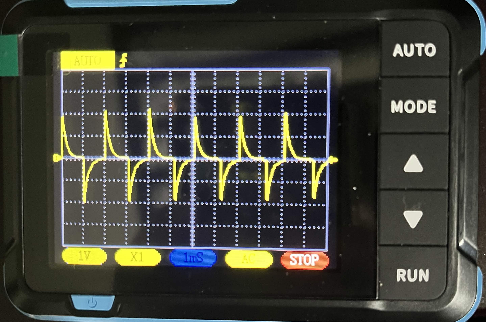
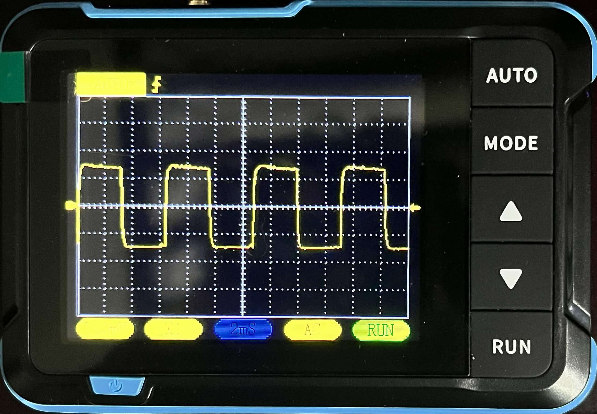
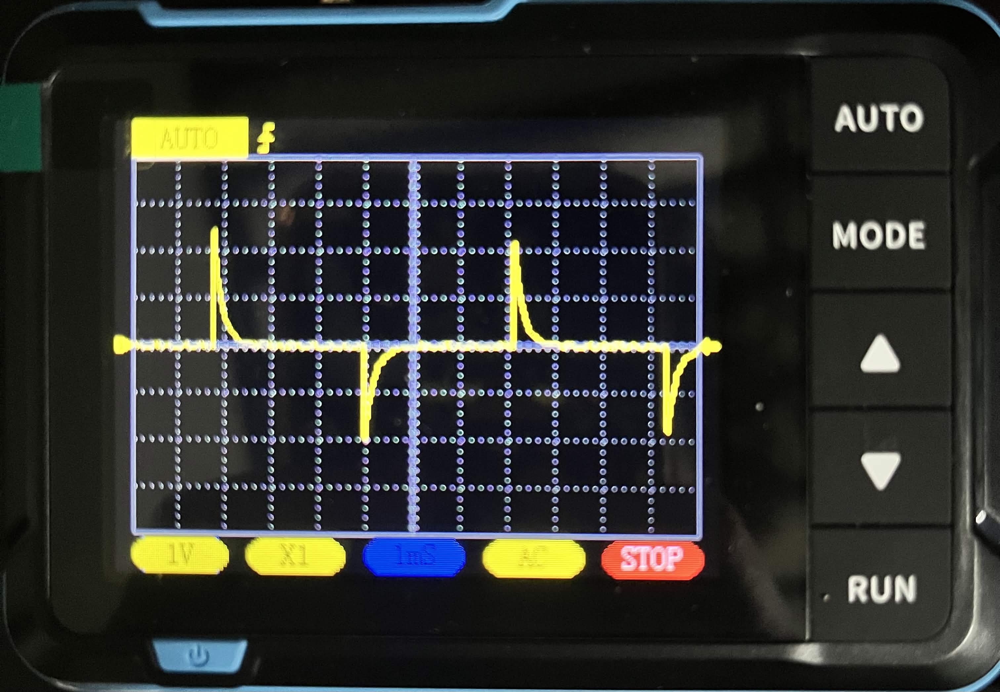
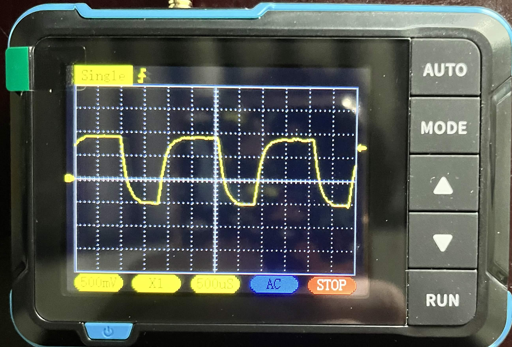
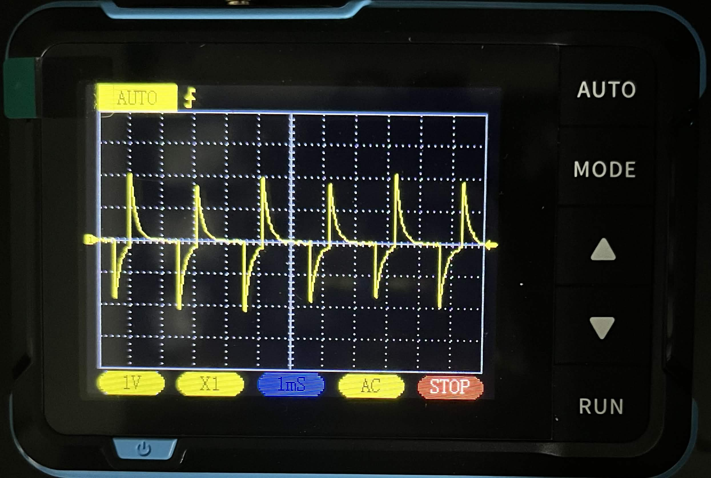

# Arduino-Signal-Generator
A signal generator made using Arduino which can toggle between outputting a sine, square, or triangle wave via PWM. Can be routed through either a low-pass filter or a high-pass filter, and includes a potentiometer to control amplitude. Signal is read through an oscilloscope.

## Features:
- Three waveforms: sine, square, and triangle
- Toggle between waves with a button
- Adjustable frequency via potentiometer
- Low-pass and high-pass filter outputs

## Components:
- Arduino MEGA 2560 R3
- 12 jumper cables
- 3 2kΩ resistors
- 3 104pF capacitors
- Push button
- 10k potentiometer
- DSO152 Oscilloscope

## Code
The full code with comments is available [here](signal_generator.ino).

Key features of the code:
- Sine wave PWM values are created via a precomputed lookup table
- Push Button uses delay-based debouncing to cycle between wave types
- Each wave type has an individually tuned delay for optimal output

## How to use:
1. Upload signal_generator.ino
2. Press button to cycle between sine, triangle, and square wave.
3. Turn potentiometer to adjust frequency.

## Wiring

## Output Examples

### Sine Wave
Low Pass: 
High Pass: 

### Square Wave
Low Pass: 
High Pass: 

### Triangle Wave
Low Pass: 
High Pass: 

### Potentiometer Amplitude Control (Click to open YouTube video)

## Known Limitations:
- Sine and triangle waves are approximations due to PWM limitations
- Higher frequencies can reduce wave quality

